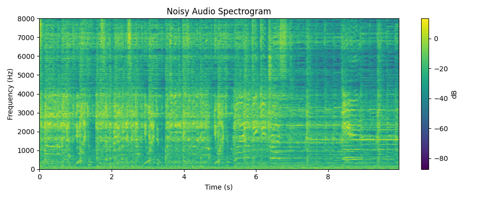
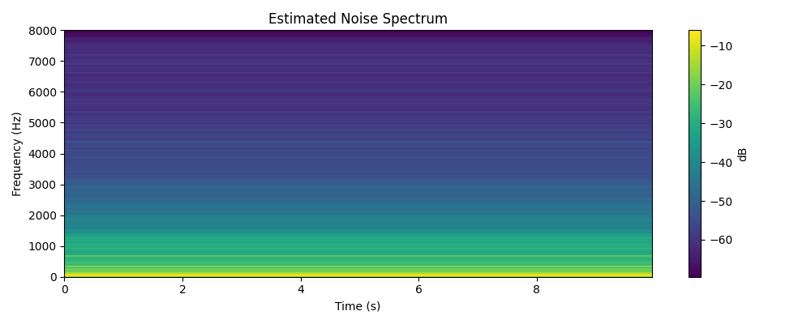

Le Duong <lnduong@usc.edu>

<<<<<<< HEAD
- best number of components: 55
- logreg performance: 72% 
- random forest perfromance on PCs: 66%

Model Exploration Plots:
Key Insights
Polynomial Kernel Transformation:
- Best performer overall for linear models (logistic regression, ridge, SVM).
- Likely expands the feature space in a way that linear models can leverage non-linearly separable boundaries.
- Works surprisingly well even for neural nets and KNN.

RBF Kernel Transformation:
- Performs consistently poorly for most models (especially perceptron and neural net).
- RBF might distort the feature space too much, especially without proper tuning of hyperparameters (like gamma) or standardization.
- Could lead to overfitting on training or loss of meaningful structure.

No Transformation:
- Still strong for tree-based methods (e.g., random forest, decision trees) and KNN.
- These models work well with original feature distributions when the raw features are informative.

PCA Transformation:
- PCA slightly reduces performance across the board.
- Likely due to dimensionality reduction discarding useful information for classification.
- Exception: helps reduce overfitting or redundancy for neural nets and random forests, but not significantly here.

Specific Model Behavior Insights:
- KNN performs best overall with raw data and polynomial kernel. Likely due to high-dimensional, localized patterns in GTZAN features.
- Random Forest is also robust across all transforms — not sensitive to feature scaling.
- Neural Network performs poorly on RBF, but excels otherwise. Likely affected by feature scale distortion from RBF.
- Linear models (Logistic, Ridge, SVM) are greatly boosted by the polynomial kernel, supporting the idea that the original data isn’t linearly separable.

Conclusions:
- Use polynomial kernel transformation when working with linear models.
- Avoid RBF transformation unless you tune hyperparameters carefully.
- KNN and Random Forest remain the most robust across transformations.
- Neural networks benefit from more structured expansions like polynomial features, not arbitrary warping like RBF.
=======
Samrit Grover <ssgrover@usc.edu>

Evangelos Neophytou <neophyto@usc.edu>

Caitlin Sullivan <ccsulliv@usc.edu>

# EE 460 Final Project: Genre Guesser

## 1. Introduction

### 1.1: Motivation

Music genre classification is a fundamental task in the field of music information 
retrieval, with applications ranging from recommendation systems, Shazam, and audio 
indexing to music therapy and automated DJing. While traditional approaches rely on 
handcrafted features or metadata, they often fall short when dealing with raw audio 
content. In this project, we aim to improve genre classification by training a deep 
learning model on 10-second audio clips from GTZAN dataset. Our approach combines CNNs, 
which are well-suited for extracting spatial features from spectrograms, with RNNs 
which effectively model temporal dependencies in sequential audio data. This hybrid 
architecture allows the model to capture both timbral textures and rhythmic patterns 
that are important for distinguishing between musical genres. We also validate the 
model’s performance using spectrograms we generate from new sound samples allowing 
real-world testing beyond the original dataset.

### 1.2: Summary of Existing Approaches

Computer vision methods on spectrograms:
- Perform FFT on wav files (time domain) and analyze song in frequency domain. 
- Using an overlapping sample sliding window (~10ms) to create spectrograms.
- Spectrograms are then fed into CNN.

Training MLPs on known numerical features (GTZAN 60-feature, Spotify API features):
- Spotify API uses abstract features that are combinations of frequency data. Some repos on GitHub tried running FNNs on this set of features and got very low accuracy compared to spectrogram CV.
- Codes on Kaggle under GTZAN have tried most linear models on the dataset with varying outcomes.


### 1.3: Anticipated Results and Milestones

1. It is expected that a CNN+RNN model would have higher accuracy compared to CNN alone.
in general will have better performance than non deep-learning models.
2. Appending numerical features to spectrograms would increase the accuracy. 
3. We will train multiple models (PCA+Random Forest, RBF+FNN) to compare with CNN model.
4 We will explore various spectrogram lengths (different Nyquist frequencies & fft bins, 
different time length).

---

## 2. Problem Formulation

### 2.1: Data Strategy (Collecting, Cleaning, Augmenting)

There are 10 different labels which are based on the music genre: `blues`, `classical`, 
`country`, `disco`, `hiphop`, `jazz`, `metal`, `pop`, `reggae`, and `rock`. For each 
music genre, there are 100 audio files of length 30 seconds. 

For each audio file there are 59 
features derived including `filename`, `length`, `chroma_stft_mean`, `Rms_mean`, 
`spectral_centroid_mean / var`, `spectral_bandwidth_mean / var`, `rolloff_mean / var`, 
`zero_crossing_rate_mean / var`, `harmony_mean / var`, `perceptr_mean / var`, `tempo`, 
`mfcc1_mean`. There are no missing values in any of the data columns, so no imputation 
is required. We removed the filename and length column since they’re not indicative 
of the song genre. For each of the features, we performed Min-Max normalization to 
scale the values between 0 and 1.

Some of the .wav files are corrupted (one in our download, to be exact). 
[dataset_health_check.py](dataset_health_check.py) examines all .wav files for validity 
and quarantines corrupted files so they are not used in the train/test split. 

### 2.2: Model Exploration

All combinations of the following data transformations and models were tested:

```
transformations = {
    "none": no_transform,
    "pca": pca_transform,
    "rbf_kernel" : rbf_transform,
    "polynomial_kernel" : polynomial_kernel
}

models = {
    "logistic_regression": train_logistic,
    "svm": train_svm,
    "perceptron": train_perceptron,
    "ridge": train_ridge,
    "decision_tree": train_decision_tree,
    "random_forest": train_random_forest,
    "KNN": train_knn,
    "neural_net" : train_nn
}
```

### 2.3: Main Model Choice and Training Approaches

### 2.4: Final System Architecture

### 2.5: Real-World Inference

[live_sample_denoised.py](live_sample_denoised.py) records 10 seconds of audio and uses
**spectral subtraction** to remove static background noise. This method uses a reference 
sample of just noise, analyzes the frequency-domain and power aspects of just the noise,
then subtracts them from the music sample while retaining phase.

#### Spectral Subtraction

1. **Noise estimation**

    - A noise-only segment taken before the music sample is used to estimate 
    the average noise spectrum, $N(f)$
    - This is done by computing the 
    Short-Time Fourier Transform (STFT) on the noise sample.


2. **STFT of noisy signal only**

    - The noisy music signal is split into overlapping frames using a window function.

    - STFT is applied to get the time-frequency representation $Y(f,t)$, where $f$ is 
    frequency and $t$ is time.


3. **magnitude subtraction from music sample**

    - For each frame and frequency bin, the estimated noise magnitude spectrum is \
   subtracted:

        $∣X(f,t)∣=max(∣Y(f,t)∣−∣N(f)∣,\epsilon)$
   
    - where $\epsilon$ is a small constant to avoid negative values


4. **phase retention**

    - The phase from the original noisy signal is retained:
   
        $X(f,t) = ∣X(f,t)∣ *  e^{j∠Y(f,t)}$


5. **reconstruction**

    - Inverse STFT (ISTFT) is used to convert the modified spectrum back into the time 
   domain, reconstructing the denoised signal.

This method does not require training data or complex models like high-end denoising and is
effective for stationary noise, like AC humming or electrical buzz. It retains musical
signature well because it only subtracts magnitude and keeps phase. That being said, it
requires a good noise estimate and assumes noise is the same through the whole sample. 
Parameters like noise floor, spectral flooring, and smoothing can be tunes for different
genres or instruments as well, but that tuning isn't used here. \

#### Spectral Subtraction Example






#### Real-World Inference

This denoised sample is turned into a spectrogram of the size expected by the CNN and can then
be fed in for inference. 

---

## 3. Outcomes

### 4.1: Model Performance on Train/Val/Test

#### 10-Second Spectrogram Trained CNN

#### 3-second Spectrogram Trained CNN

`Train Eval: 100%|██████████| 219/219 [08:44<00:00,  2.39s/batch, loss=0.129, acc=99.2]`

`Val: 100%|██████████| 47/47 [01:53<00:00,  2.42s/batch, loss=0.727, acc=76.2]`

`Test: 100%|██████████| 47/47 [02:00<00:00,  2.55s/batch, loss=0.639, acc=78.7]`

There was overfitting. This might have been a function of the length of the spectrogram

### 4.2: Problems and Challenges

#### CNN Size and Computing Limits
Each CNN training (did 7) took almost an entire day on one device. On GPU, the
CNNs processing larger images took 14 hours or so each. It's probable that either the 
CNN needed longer spectrograms to make more accurate predictions or needed to be deeper,
both of which would have exponentially increased model complexity outside of this
project's time frame and our computing capability.

### 4.3: Future Work

We would like to test more CNN architectures, probably with more VGG blocks or other Resnets,
to see if the accuracy can be improved. 

---

## 4. Task Summary and Teamwork Breakdown

Le Duong: 

- Generated 7 CNNs to test architecture and input data dimension
- CNN training and inference pipeline
- Wrote original spectrogram generator protocol
- developed method to concatenate features onto last layer of CNN

**estimated hours spent: 10**

Samrit Grover: 

- 4x6 model exploration
- Result reports and interpretation

**estimated hours spent: 10**

Evangelos Neophytou: 

- Model exploration: code, graphs, neural network imp
- RNN implementation (not used in final product but in project)
- PCA and K-means explorations

**estimated hours spent: 10**

Caitlin Sullivan: 

- Scripted data cleaning
- Live data collection pipeline: recording, de-noising, creating spectrogram, feeding to CNN
- Adjusted spectrograms: resizing, downsampling for different CNN architectures
- CNN training and inference pipeline
- Report

**estimated hours spent: 10**
>>>>>>> 9ff4c834f41413537a1e9d99a7cb6264ee7dfd21
