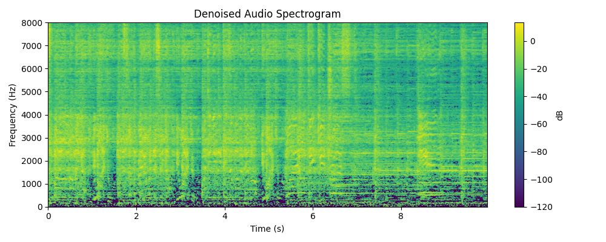

Le Duong <lnduong@usc.edu>

Samrit Grover <ssgrover@usc.edu>

Evangelos Neophytou <neophyto@usc.edu>

Caitlin Sullivan <ccsulliv@usc.edu>

# EE 460 Final Project: Music Genre Guesser

### [goto: Repository Inventory](INVENTORY.md)

## 1. Introduction

### 1.1: Motivation

Music genre classification is a fundamental task in the field of music information 
retrieval, with applications ranging from recommendation systems, Shazam, and audio 
indexing to music therapy and automated DJing. While traditional approaches rely on 
handcrafted features or metadata, they often fall short when dealing with raw audio 
content. In this project, we aim to improve genre classification by training a deep 
learning model on 10-second audio clips from GTZAN dataset. Our approach combines CNNs, 
which are well-suited for extracting spatial features from spectrograms, with RNNs 
which effectively model temporal dependencies in sequential audio data. This hybrid 
architecture allows the model to capture both timbral textures and rhythmic patterns 
that are important for distinguishing between musical genres. We also validate the 
model’s performance using spectrograms we generate from new sound samples allowing 
real-world testing beyond the original dataset.

### 1.2: Summary of Existing Approaches

[Computer vision methods on spectrograms](https://github.com/crlandsc/Music-Genre-Classification-Using-Convolutional-Neural-Networks/blob/main/code/02_modeling.ipynb):
- Perform FFT on wav files (time domain) and analyze song in frequency domain. 
- Using an overlapping sample sliding window (~10ms) to create spectrograms.
- Spectrograms are then fed into CNN.
- CNN model used: [(Conv2d -> BatchNormalization -> MaxPooling -> Dropout) x 3] -> MLP_Classifer
- Accuracy: 83.8%

Training MLPs on known numerical features (GTZAN 60-feature, Spotify API features):
- Spotify API uses abstract features that are combinations of frequency data. Some repos on GitHub tried running FNNs on this set of features and got very low accuracy compared to spectrogram CV. (The project we linked [here](https://github.com/crlandsc/Music-Genre-Classification-Using-Convolutional-Neural-Networks/blob/main/code/02_modeling.ipynb) uses DNN, which is essentially deeper FNN, and got 51.5% accuracy)
- Codes on Kaggle under GTZAN have tried most linear models on the dataset with varying outcomes.


### 1.3: Anticipated Results and Milestones

1. We expect that integrating a CNN+RNN model would have higher accuracy compared to CNN alone. A CNN in general will have better performance than non deep-learning models.
2. Appending numerical features to spectrograms would increase the accuracy. 
3. We will train multiple numerical feature models (PCA+Random Forest, RBF+FNN) to compare with the spectrogram model (CNN).
4. We will explore various spectrogram lengths (different Nyquist frequencies & fft bins, 
different time length).
5. We will explore a couple of different CNN architectures (a simple and a more complicated one) and explore how much it affect the accuracies.

---

## 2. Problem Formulation

### 2.1: Data Strategy (Collecting, Cleaning, Augmenting)

Dataset: [GTZAN](https://www.kaggle.com/datasets/andradaolteanu/gtzan-dataset-music-genre-classification) (source: Kaggle)

3 types of files: .wav (30 sec audio samples), .png (30 sec spectrograms), .csv (hand-designed features on 30s & 3s audio sample)

There are 10 different labels which are based on the music genre: `blues`, `classical`, 
`country`, `disco`, `hiphop`, `jazz`, `metal`, `pop`, `reggae`, and `rock`. For each 
music genre, there are 100 audio files of length 30 seconds. 

For each audio file there are 60 
features derived including `filename`, `length`, `chroma_stft_mean / var`, `RMS_mean / var`, 
`spectral_centroid_mean / var`, `spectral_bandwidth_mean / var`, `rolloff_mean / var`, 
`zero_crossing_rate_mean / var`, `harmony_mean / var`, `perceptr_mean / var`, `tempo`, 20 `mfcc_mean / var`, and class label. There are no missing values in any of the data columns, so no imputation is required. We removed the filename and length column since they’re not indicative 
of the song genre. For each of the features, we performed Min-Max normalization to 
scale the values between 0 and 1.

Some of the .wav files are corrupted (one in our download, to be exact). 
[dataset_health_check.py](dataset_health_check.py) examines all .wav files for validity 
and quarantines corrupted files so they are not used in the train/test split. 

One of the rows in 3-sec-feature .csv (corresponding to one 3-second sample) was missing and caused mismatch in the generated 3-seconds spectrogram dataset and the 3-second hand-design features dataset. This was a huge issue when we tried to integrate the hand-design features with our CNN because we were pulling data from 2 different datasets and tried to combine them. We ended up cross-checking the size of each set and deleted the extra image in our spec. dataset. In hindsight, this wouldn't have been an issue if we were to generate both spectrogram and hand-design features from the same 3-second audio. We will definitely keep this in mind for furture cases. 

### 2.2: Model Exploration

All combinations of the following data transformations and models were tested:

```
transformations = {
    "none": no_transform,
    "pca": pca_transform,
    "rbf_kernel" : rbf_transform,
    "polynomial_kernel" : polynomial_kernel
}

models = {
    "logistic_regression": train_logistic,
    "svm": train_svm,
    "perceptron": train_perceptron,
    "ridge": train_ridge,
    "decision_tree": train_decision_tree,
    "random_forest": train_random_forest,
    "KNN": train_knn,
    "neural_net" : train_nn
}
```

#### Model Performance Summary


#### All Loss and Accuracy Functions: See [model exploration plots](model_exploration/plots)
Note: Trial in these graphs refers to one iteration of hyperparameter tuning. 


#### Transformation Key Insights
#### ↪ Polynomial Kernel Transformation:
- Best performer overall for linear models (logistic regression, ridge, SVM).
- Likely expands the feature space in a way that linear models can leverage non-linearly separable boundaries.
- Works surprisingly well even for neural nets and KNN.

#### ↪ RBF Kernel Transformation:
- Performs consistently poorly for most models (especially perceptron and neural net).
- RBF might distort the feature space too much, especially without proper tuning of hyperparameters (like gamma) or standardization.
- Could lead to overfitting on training or loss of meaningful structure.

#### ↪ No Transformation:
- Still strong for tree-based methods (e.g., random forest, decision trees) and KNN.
- These models work well with original feature distributions when the raw features are informative.

#### ↪ PCA Transformation:
- PCA slightly reduces performance across the board.
- Likely due to dimensionality reduction discarding useful information for classification.
- Exception: helps reduce overfitting or redundancy for neural nets and random forests, but not significantly here.

#### Models Key Insights
#### ↪ Logistic Regression:
- Linear model
- Models probability of binary outcome based on linear outcome of input features
- Uses sigmoid/softmax for multi-class prediction
- Hyperparameter `C` controls regularization strength
- Lower 'C' results in stronger regularization, which prevents overfitting

#### ↪ Support Vector Machine (SVM):
- Linear model
- Model fins best hyperplane that separates data points with largest possible margin
- Margin defined as distance between hyperplane and the support vectors
- Effective for high-dimensional datasets
- Low 'C' results in underfitting while High 'C' results in overfitting
- Works well with not linearly separable data, but struggles with noisy data

#### ↪ Perceptron:
- Linear Model
- Gets linear outcome of input features then applies activation functions
- Prediction based on activation output below/above a threshold
- Relatively simpler classifier and good for linearly separable problems
- Learning rates affects rate of conversion
- Tends to underperform with complex/non-linear data

#### ↪ Ridge Classifier:
- Linear model
- Based on L2 regression with penalty term (L2 regularization) added to loss function
- Penatly prevents overfitting by keeping size of weights in consideration
- 'alpha' term determines the strength of the regularization term
- Doesn't perform very well with non-linear data

#### ↪ Decision Tree:
- Non-linear model
- Divides data at each node of tree based on condition
- Hyperparameter 'max_depth' controls the depth of the tree
- Shallow trees underfit while deep trees often overfit
- Excellent for classification tasks and capturing non-linear data

#### ↪ Random Forest:
- Non-linear model
- Aggregates multiple decision trees to improve generalization
- Each tree gives a classification and majority of prediction is outcome of ensemble
- Has 2 hyperparameters 'max_depth' and 'n_estimators' which control depth of tree and number of trees
- Lower value of hyperparameters results in underfitting while higher results in overfitting
- Works really well on classification tasks and capturing non-linear data
- Can become computationally expensive & slow to train based on # of trees and depth of trees

  #### ↪ K-Nearest Neighbors (KNN):
- Non-linear model
- To classify, finds 'k' closest data points within dataset using distance metric (often 'L2')
- Class label is determined by majority classification among the 'k' neighbors
- Has 2 hyperparameters 'n_neighbors' and 'weights'
    - First looks at number of neighbors to base decision on
    - Second decides whether closer neighbors get higher priority in final prediction
- Works excellect with medium-sized datasets, striking a balance between underfitting and overfitting

  #### ↪ Neural Network:
- Non-linear model
- Model consists of several interconnected layers of neurons ('3' layers in our project)
- First layer receives features of dataset as input
- Last layer outputs to '10' neurons which is our song classification
- Neurons at each layer receive output of an activation function performed on linearly weighted sum from the neurons in the previous layer
- Backpropogation enables model weights to be optimized
- Utilized batch normalization dropout to prevent overfitting
- Layers: Sequential model with 3 hidden layers (256 -> 128 -> 64 neurons), each followed by BatchNorm, ReLu activation, and dropout (20% -> 30% -> 40%)
- Works really well at capturing complex relationships form high-dimensional data
- Better at regression compared to classification, but still very strong for classification

#### Specific Model Behavior
- KNN performs best overall with raw data and polynomial kernel. Likely due to high-dimensional, localized patterns in GTZAN features.
- Random Forest is also robust across all transforms — not sensitive to feature scaling.
- Neural Network performs poorly on RBF, but excels otherwise. Likely affected by feature scale distortion from RBF.
- Linear models (Logistic, Ridge, SVM) are greatly boosted by the polynomial kernel, supporting the idea that the original data isn’t linearly separable.

#### Conclusions
- Use polynomial kernel transformation when working with linear models.
- Avoid RBF transformation unless you tune hyperparameters carefully.
- KNN and Random Forest remain the most robust across transformations.
- Neural networks benefit from more structured expansions like polynomial features, not arbitrary warping like RBF.


### 2.3: Main Model Choice and Training Approaches

2 types of architectures were used: Mini-VGG and ResNet34

Sources:
1) [Mini-VGG: modified from lecture](https://github.com/keithchugg/ee460_spring2025/blob/5b3d0470705ff236a212415c1e510630627afd2d/lecture/02_fmnist_mlp_torch.ipynb)
2) [ResNet34: modified from Kaggle](https://www.kaggle.com/code/khoongweihao/resnet-34-pytorch-starter-kit)


We used a convolutional neural network as our primary approach, utilizing the two architectures above. We went through optimizing with different spectrogram lengths and depths especially for the Mini-VGG architecture. The training approaches will be explained in Section 3 as they differ in every version of the CNN. 

However, in general, our approach is to have a pre-generated spectrogram dataset of our desired length and feed that into the CNN through dataloaders. Once it goes through the Convolution layers, it will then get flatten and connected to an MLP which will connect all the convolution parameters together, train the learned features, then output a tensor of size 10 (aka the probability of each genre) and we would run it through an argmax to get the final predicted genre. 

In all the models, we were also using the Adam optimizer as it gives the gradient some momentum based on the gradients from previous updates and allow quicker convergence. Adam also has L2 regularization (weight_decay) and we used it along with dropouts and batch normalization to regularize and generalize the model. We also used the Cross Entropy Loss since it gives probabilities for multiple classes. 

Because each training usually takes us around 3-4 hours on the Mini-VGG and 7-9 hours on the ResNet34, it didn't make sense for us to try and optimize the hyperparameters especially when we know the reccommended default values works great for the architecture we're using. 


#### Architecture 1: Mini VGG


This diagram is a 2-block Mini-VGG, taken from lectures as our first target was to create a working CNN for our specific dataset. The Mini-VGG was a simple CNN model and easy to manipulate. It also trained relatively fast enough to test out a few different models with varying depths, fully connected nodes, and numbers of filters.

#### Architecture 2: ResNet 34


When it comes to image classification, ResNets are one of the most popular architectures and is very good with avoiding the vanishing gradient problem due to its ability to skip layers (residual connections) and avoid learning through only 1 specific way. This is very helpful for our model because spectrograms are complicated in and of itself and require alot of deep learning which most models eventually lead to the vanishing gradient and the NN is unable to learn anymore. 


### 2.4: Real-World Inference

[live_sample_denoised.py](live_sample_denoised.py) records 10 seconds of audio and uses
**spectral subtraction** to remove static background noise. This method uses a reference 
sample of just noise, analyzes the frequency-domain and power aspects of just the noise,
then subtracts them from the music sample while retaining phase.

#### Spectral Subtraction

1. **Noise estimation**

    - A noise-only segment taken before the music sample is used to estimate 
    the average noise spectrum, $N(f)$
    - This is done by computing the 
    Short-Time Fourier Transform (STFT) on the noise sample.


2. **STFT of noisy signal only**

    - The noisy music signal is split into overlapping frames using a window function.

    - STFT is applied to get the time-frequency representation $Y(f,t)$, where $f$ is 
    frequency and $t$ is time.


3. **magnitude subtraction from music sample**

    - For each frame and frequency bin, the estimated noise magnitude spectrum is \
   subtracted:

        $∣X(f,t)∣=max(∣Y(f,t)∣−∣N(f)∣,\epsilon)$
   
    - where $\epsilon$ is a small constant to avoid negative values


4. **phase retention**

    - The phase from the original noisy signal is retained:
   
        $X(f,t) = ∣X(f,t)∣ *  e^{j∠Y(f,t)}$


5. **reconstruction**

    - Inverse STFT (ISTFT) is used to convert the modified spectrum back into the time 
   domain, reconstructing the denoised signal.

This method does not require training data or complex models like high-end denoising and is
effective for stationary noise, like AC humming or electrical buzz. It retains musical
signature well because it only subtracts magnitude and keeps phase. That being said, it
requires a good noise estimate and assumes noise is the same through the whole sample. 
Parameters like noise floor, spectral flooring, and smoothing can be tunes for different
genres or instruments as well, but that tuning isn't used here. \

#### Spectral Subtraction Example




#### Inference

This denoised sample is turned into a spectrogram of the size expected by the CNN and can then
be fed in for inference. 

---

## 3. Outcomes

### 3.1: CNN Models Performance on Train/Val/Test

#### [V3: 15-Second Spectrogram Trained Mini-VGG (2-blocks)](https://github.com/ccorduroy/genreguessr/blob/de9a36fd135d69d0442dfa62df09a4e7ef80da44/CNN/test_CNN_v3.ipynb)

This is our first "solid" training for the Mini-VGG model. 

Our goal with this model is to test whether the Mini-VGG model is sufficient for what we want to do. However, can shown below, the model overfits, and the accurcy isn't very high. We suspected that the spectrograms' length could controbute to this issue, since 15 seconds is very dense and the convolution layers may not be able to pick up on the patterns. Additionally, since our original 30 seconds dataset only has 1000 data poins, this means our entire dataet for 15 seconds, which is pretty small for a spectrogram CNN (compared to the simple MNIST, which has 70,000 samples). Finally, we also suspec **TO BE CONTINUED

```
----------------------------------------------------------------
        Layer (type)               Output Shape         Param #
================================================================
            Conv2d-1         [-1, 32, 480, 640]             896
              ReLU-2         [-1, 32, 480, 640]               0
       BatchNorm2d-3         [-1, 32, 480, 640]              64
            Conv2d-4         [-1, 32, 480, 640]           9,248
              ReLU-5         [-1, 32, 480, 640]               0
       BatchNorm2d-6         [-1, 32, 480, 640]              64
         MaxPool2d-7         [-1, 32, 240, 320]               0
         Dropout2d-8         [-1, 32, 240, 320]               0
            Conv2d-9         [-1, 64, 240, 320]          18,496
             ReLU-10         [-1, 64, 240, 320]               0
      BatchNorm2d-11         [-1, 64, 240, 320]             128
           Conv2d-12         [-1, 64, 240, 320]          36,928
             ReLU-13         [-1, 64, 240, 320]               0
      BatchNorm2d-14         [-1, 64, 240, 320]             128
        MaxPool2d-15         [-1, 64, 120, 160]               0
        Dropout2d-16         [-1, 64, 120, 160]               0
          Flatten-17              [-1, 1228800]               0
           Linear-18                  [-1, 512]     629,146,112
             ReLU-19                  [-1, 512]               0
      BatchNorm1d-20                  [-1, 512]           1,024
        Dropout1d-21                  [-1, 512]               0
           Linear-22                   [-1, 10]           5,130
================================================================
Total params: 629,218,218
Trainable params: 629,218,218
Non-trainable params: 0
----------------------------------------------------------------
Input size (MB): 3.52
Forward/backward pass size (MB): 740.64
Params size (MB): 2400.28
Estimated Total Size (MB): 3144.43
----------------------------------------------------------------

Val: 100%|██████████| 4/4 [00:13<00:00,  3.29s/batch, loss=1.19, acc=59.9] 
Test accuracy: 0.5990

```


#### [V5: 15-second Spectrogram Mini-VGG (3-blocks)](https://github.com/ccorduroy/genreguessr/blob/837f3f954a09e46376bf6a565d2d06fc632723ff/CNN/CNN_v9_3_sec_resNet34_w_features.py)

Version 5 is still a Mini-VGG, with the exception that it is now 3 mini-vgg blocks instead of 2 in version 3. 

```
----------------------------------------------------------------
        Layer (type)               Output Shape         Param #
================================================================
            Conv2d-1         [-1, 32, 480, 640]             320
              ReLU-2         [-1, 32, 480, 640]               0
       BatchNorm2d-3         [-1, 32, 480, 640]              64
            Conv2d-4         [-1, 32, 480, 640]           9,248
              ReLU-5         [-1, 32, 480, 640]               0
       BatchNorm2d-6         [-1, 32, 480, 640]              64
         MaxPool2d-7         [-1, 32, 240, 320]               0
         Dropout2d-8         [-1, 32, 240, 320]               0
            Conv2d-9         [-1, 64, 240, 320]          18,496
             ReLU-10         [-1, 64, 240, 320]               0
      BatchNorm2d-11         [-1, 64, 240, 320]             128
           Conv2d-12         [-1, 64, 240, 320]          36,928
             ReLU-13         [-1, 64, 240, 320]               0
      BatchNorm2d-14         [-1, 64, 240, 320]             128
        MaxPool2d-15         [-1, 64, 120, 160]               0
        Dropout2d-16         [-1, 64, 120, 160]               0
           Conv2d-17        [-1, 128, 120, 160]          73,856
             ReLU-18        [-1, 128, 120, 160]               0
      BatchNorm2d-19        [-1, 128, 120, 160]             256
           Conv2d-20        [-1, 128, 120, 160]         147,584
             ReLU-21        [-1, 128, 120, 160]               0
      BatchNorm2d-22        [-1, 128, 120, 160]             256
        MaxPool2d-23          [-1, 128, 60, 80]               0
        Dropout2d-24          [-1, 128, 60, 80]               0
          Flatten-25               [-1, 614400]               0
           Linear-26                  [-1, 512]     314,573,312
             ReLU-27                  [-1, 512]               0
      BatchNorm1d-28                  [-1, 512]           1,024
        Dropout1d-29                  [-1, 512]               0
           Linear-30                   [-1, 10]           5,130
================================================================
Total params: 314,866,794
Trainable params: 314,866,794
Non-trainable params: 0
----------------------------------------------------------------
Input size (MB): 1.17
Forward/backward pass size (MB): 857.83
Params size (MB): 1201.12
Estimated Total Size (MB): 2060.12
----------------------------------------------------------------

Val: 100%|██████████| 13/13 [01:04<00:00,  4.94s/batch, loss=0.95, acc=68.7] 
Test accuracy: 0.6865
```

The accuracy is roughly a 10% increase from version 3 by just adding another block of mini-vgg and increasing the depth of the NN. The drawback was that it did also increase the training time for 1 epoch from 6 minutes (v3) to 12 minutes (v5). However, this goes to show that the learning did not cap off at 4 Conv2d layers and increasing the depth will help increase accuracy. Because of the vanishing gradient problem, we didn't want to just increase the number of blocks. Even with using ReLU as our activation function, it still somwhat contribute to the vanishing gradient. Hence, from here, we decided to diverge from the Mini-VGG architecture and used the ResNet34 instead as it allows the convolution to skip some layers and help with the vanishing gradient problem while being deep enough to allow the model to continue training. 


#### [(DEMO) V7: 3-Second Spectrogram Trained ResNet34 ](https://github.com/ccorduroy/genreguessr/blob/aa168d09aac060f386d8db754d42827f9c3113f8/CNN_v7_3sec_ResNet_w_demo/test_CNN_v7_3_sec.ipynb)

This is the model we decided to use during our live demo. The architecture was not a pre-trained model. Instead, this the help of[ this Kaggle project on the ResNet34](https://www.kaggle.com/code/khoongweihao/resnet-34-pytorch-starter-kit), we were able to get the (almost) ResNet34 architecture implemented using torch.nn. This was really helpful because:
1) We wanted to avoid using pre-trained model as that defeats the purpose of use doing CNN model exploration.
2) This allows us to modify the architecture freely to fit our use (this mainly includes adding our own Dense/Classifying layers and gave us alot of dimensionality freedom, which is very helpful when appending features)
3) Allows us to see how the ResNet works.
4) Allows us to train our own weights to test against the Mini-VGG using the same dataset.

Note: We also decreased our spectrogram length to 3sec to enlarge the dataset, which would definitely help increase the accuracy. 3 seconds also seem to be the ideal length in many ML spectrogram projects that we see. We did try to test the varying spectrogram length (15sec vs 10sec) between version 3 and 4. However, our v4 (10sec) dataset indices unfortutately got messed up and we weren't able to test the accuracy correctly. Nevertheless, the validation was sitting at around 70-78%, which did seem to be an improvement from 15sec spectrograms. We didn't have time nor compute power to retrain it as our main focus at that moment was shifted towards getting higher accuracies (+90%). 

```
----------------------------------------------------------------
        Layer (type)               Output Shape         Param #
================================================================
            Conv2d-1         [-1, 64, 259, 259]             256
       BatchNorm2d-2         [-1, 64, 259, 259]             128
              ReLU-3         [-1, 64, 259, 259]               0
         MaxPool2d-4         [-1, 64, 129, 129]               0
            Conv2d-5         [-1, 64, 129, 129]          36,864
       BatchNorm2d-6         [-1, 64, 129, 129]             128
              ReLU-7         [-1, 64, 129, 129]               0
            Conv2d-8         [-1, 64, 129, 129]          36,864
       BatchNorm2d-9         [-1, 64, 129, 129]             128
    ResidualBlock-10         [-1, 64, 129, 129]               0
           Conv2d-11           [-1, 64, 65, 65]          36,864
      BatchNorm2d-12           [-1, 64, 65, 65]             128
             ReLU-13           [-1, 64, 65, 65]               0
           Conv2d-14           [-1, 64, 65, 65]          36,864
      BatchNorm2d-15           [-1, 64, 65, 65]             128
           Conv2d-16           [-1, 64, 65, 65]           4,096
      BatchNorm2d-17           [-1, 64, 65, 65]             128
    ResidualBlock-18           [-1, 64, 65, 65]               0
           Conv2d-19          [-1, 128, 65, 65]          73,728
      BatchNorm2d-20          [-1, 128, 65, 65]             256
             ReLU-21          [-1, 128, 65, 65]               0
           Conv2d-22          [-1, 128, 65, 65]         147,456
      BatchNorm2d-23          [-1, 128, 65, 65]             256
           Conv2d-24          [-1, 128, 65, 65]           8,192
      BatchNorm2d-25          [-1, 128, 65, 65]             256
    ResidualBlock-26          [-1, 128, 65, 65]               0
           Conv2d-27          [-1, 128, 33, 33]         147,456
      BatchNorm2d-28          [-1, 128, 33, 33]             256
             ReLU-29          [-1, 128, 33, 33]               0
           Conv2d-30          [-1, 128, 33, 33]         147,456
      BatchNorm2d-31          [-1, 128, 33, 33]             256
           Conv2d-32          [-1, 128, 33, 33]          16,384
      BatchNorm2d-33          [-1, 128, 33, 33]             256
    ResidualBlock-34          [-1, 128, 33, 33]               0
           Conv2d-35          [-1, 256, 33, 33]         294,912
      BatchNorm2d-36          [-1, 256, 33, 33]             512
             ReLU-37          [-1, 256, 33, 33]               0
           Conv2d-38          [-1, 256, 33, 33]         589,824
      BatchNorm2d-39          [-1, 256, 33, 33]             512
           Conv2d-40          [-1, 256, 33, 33]          32,768
      BatchNorm2d-41          [-1, 256, 33, 33]             512
    ResidualBlock-42          [-1, 256, 33, 33]               0
           Conv2d-43          [-1, 256, 17, 17]         589,824
      BatchNorm2d-44          [-1, 256, 17, 17]             512
             ReLU-45          [-1, 256, 17, 17]               0
           Conv2d-46          [-1, 256, 17, 17]         589,824
      BatchNorm2d-47          [-1, 256, 17, 17]             512
           Conv2d-48          [-1, 256, 17, 17]          65,536
      BatchNorm2d-49          [-1, 256, 17, 17]             512
    ResidualBlock-50          [-1, 256, 17, 17]               0
           Conv2d-51          [-1, 512, 17, 17]       1,179,648
      BatchNorm2d-52          [-1, 512, 17, 17]           1,024
             ReLU-53          [-1, 512, 17, 17]               0
           Conv2d-54          [-1, 512, 17, 17]       2,359,296
      BatchNorm2d-55          [-1, 512, 17, 17]           1,024
           Conv2d-56          [-1, 512, 17, 17]         131,072
      BatchNorm2d-57          [-1, 512, 17, 17]           1,024
    ResidualBlock-58          [-1, 512, 17, 17]               0
           Conv2d-59            [-1, 512, 9, 9]       2,359,296
      BatchNorm2d-60            [-1, 512, 9, 9]           1,024
             ReLU-61            [-1, 512, 9, 9]               0
           Conv2d-62            [-1, 512, 9, 9]       2,359,296
      BatchNorm2d-63            [-1, 512, 9, 9]           1,024
           Conv2d-64            [-1, 512, 9, 9]         262,144
      BatchNorm2d-65            [-1, 512, 9, 9]           1,024
    ResidualBlock-66            [-1, 512, 9, 9]               0
        AvgPool2d-67            [-1, 512, 4, 4]               0
           Linear-68                 [-1, 1000]       8,193,000
             ReLU-69                 [-1, 1000]               0
      BatchNorm1d-70                 [-1, 1000]           2,000
        Dropout1d-71                 [-1, 1000]               0
           Linear-72                   [-1, 10]          10,010
================================================================
Total params: 19,722,450
Trainable params: 19,722,450
Non-trainable params: 0
----------------------------------------------------------------
Input size (MB): 1.00
Forward/backward pass size (MB): 246.35
Params size (MB): 75.24
Estimated Total Size (MB): 322.58
----------------------------------------------------------------

Val: 100%|██████████| 47/47 [01:31<00:00,  1.94s/batch, loss=0.323, acc=88.5]
Test accuracy: 0.8847
```
As we can see in the plots before, the ResNet34 model has a much higher accuracy compared to any of the Mini-VGG models and it also does alot better in terms of generalization. Believe the size of the model, as discussed in previous sections, helps alot with allowing the deeper layers to see more of the original image.


#### [(BEST) V10: 3-Second Spectrogram Traines Resnet with Appended Numeric Features (Re-Normalized)](https://github.com/ccorduroy/genreguessr/blob/aa168d09aac060f386d8db754d42827f9c3113f8/CNN/CNN_v10_3_sec_resNet34_w_features_normalized.py)

Ultimately, our goal was to feed our CNN output + features with an RNN model to allow further learning, and hopefully increase the accuracy. However, due to time-contraints, we weren't able to integrate the combined CNN+RNN. Instead, due to our past high result with the FNN that Samrit trained, we were hoping that feeding in the hand-design features to the MLP layer along with the features fron convolution would drives up the accuracy as well. 

Unfortunately, while we sucessfully got the features to pass into the CNN, we made the mistake of not normalizing the features and thus couldn't produce any meaningful results. However, after our demo, we retrained the model with the normalized hand-design features and our accuracy increased to 91.67% as shown below, which is a 3.2% increase from v7 (CNN without the hand-design features). 

Overall, we think the accuracy could improve even more if we were to somehow normalize the features from the convolutional layers as well. However, since they're all learned and we wouldn't have those features until each datapoint is trained, it's very difficult to normalize them. However, perhaps we could instead sample the average range of those learned features and normalize our hand-design features to match the learned features. This would be a very interesting future experiment.

```
----------------------------------------------------------------
        Layer (type)               Output Shape         Param #
================================================================
            Conv2d-1         [-1, 64, 259, 259]             256
       BatchNorm2d-2         [-1, 64, 259, 259]             128
              ReLU-3         [-1, 64, 259, 259]               0
         MaxPool2d-4         [-1, 64, 129, 129]               0
            Conv2d-5         [-1, 64, 129, 129]          36,864
       BatchNorm2d-6         [-1, 64, 129, 129]             128
              ReLU-7         [-1, 64, 129, 129]               0
            Conv2d-8         [-1, 64, 129, 129]          36,864
       BatchNorm2d-9         [-1, 64, 129, 129]             128
    ResidualBlock-10         [-1, 64, 129, 129]               0
           Conv2d-11           [-1, 64, 65, 65]          36,864
      BatchNorm2d-12           [-1, 64, 65, 65]             128
             ReLU-13           [-1, 64, 65, 65]               0
           Conv2d-14           [-1, 64, 65, 65]          36,864
      BatchNorm2d-15           [-1, 64, 65, 65]             128
           Conv2d-16           [-1, 64, 65, 65]           4,096
      BatchNorm2d-17           [-1, 64, 65, 65]             128
    ResidualBlock-18           [-1, 64, 65, 65]               0
           Conv2d-19          [-1, 128, 65, 65]          73,728
      BatchNorm2d-20          [-1, 128, 65, 65]             256
             ReLU-21          [-1, 128, 65, 65]               0
           Conv2d-22          [-1, 128, 65, 65]         147,456
      BatchNorm2d-23          [-1, 128, 65, 65]             256
           Conv2d-24          [-1, 128, 65, 65]           8,192
      BatchNorm2d-25          [-1, 128, 65, 65]             256
    ResidualBlock-26          [-1, 128, 65, 65]               0
           Conv2d-27          [-1, 128, 33, 33]         147,456
      BatchNorm2d-28          [-1, 128, 33, 33]             256
             ReLU-29          [-1, 128, 33, 33]               0
           Conv2d-30          [-1, 128, 33, 33]         147,456
      BatchNorm2d-31          [-1, 128, 33, 33]             256
           Conv2d-32          [-1, 128, 33, 33]          16,384
      BatchNorm2d-33          [-1, 128, 33, 33]             256
    ResidualBlock-34          [-1, 128, 33, 33]               0
           Conv2d-35          [-1, 256, 33, 33]         294,912
      BatchNorm2d-36          [-1, 256, 33, 33]             512
             ReLU-37          [-1, 256, 33, 33]               0
           Conv2d-38          [-1, 256, 33, 33]         589,824
      BatchNorm2d-39          [-1, 256, 33, 33]             512
           Conv2d-40          [-1, 256, 33, 33]          32,768
      BatchNorm2d-41          [-1, 256, 33, 33]             512
    ResidualBlock-42          [-1, 256, 33, 33]               0
           Conv2d-43          [-1, 256, 17, 17]         589,824
      BatchNorm2d-44          [-1, 256, 17, 17]             512
             ReLU-45          [-1, 256, 17, 17]               0
           Conv2d-46          [-1, 256, 17, 17]         589,824
      BatchNorm2d-47          [-1, 256, 17, 17]             512
           Conv2d-48          [-1, 256, 17, 17]          65,536
      BatchNorm2d-49          [-1, 256, 17, 17]             512
    ResidualBlock-50          [-1, 256, 17, 17]               0
           Conv2d-51          [-1, 512, 17, 17]       1,179,648
      BatchNorm2d-52          [-1, 512, 17, 17]           1,024
             ReLU-53          [-1, 512, 17, 17]               0
           Conv2d-54          [-1, 512, 17, 17]       2,359,296
      BatchNorm2d-55          [-1, 512, 17, 17]           1,024
           Conv2d-56          [-1, 512, 17, 17]         131,072
      BatchNorm2d-57          [-1, 512, 17, 17]           1,024
    ResidualBlock-58          [-1, 512, 17, 17]               0
           Conv2d-59            [-1, 512, 9, 9]       2,359,296
      BatchNorm2d-60            [-1, 512, 9, 9]           1,024
             ReLU-61            [-1, 512, 9, 9]               0
           Conv2d-62            [-1, 512, 9, 9]       2,359,296
      BatchNorm2d-63            [-1, 512, 9, 9]           1,024
           Conv2d-64            [-1, 512, 9, 9]         262,144
      BatchNorm2d-65            [-1, 512, 9, 9]           1,024
    ResidualBlock-66            [-1, 512, 9, 9]               0
        AvgPool2d-67            [-1, 512, 4, 4]               0
           Linear-68                 [-1, 1000]       8,250,000
             ReLU-69                 [-1, 1000]               0
      BatchNorm1d-70                 [-1, 1000]           2,000
        Dropout1d-71                 [-1, 1000]               0
           Linear-72                   [-1, 10]          10,010
================================================================
Total params: 19,779,450
Trainable params: 19,779,450
Non-trainable params: 0
----------------------------------------------------------------
Input size (MB): 57.00
Forward/backward pass size (MB): 246.35
Params size (MB): 75.45
Estimated Total Size (MB): 378.80
----------------------------------------------------------------
```

`Train: 100%|██████████| 219/219 [01:42<00:00,  2.14batch/s, loss=0.587, acc=77.4]`

`Train Eval: 100%|██████████| 219/219 [00:46<00:00,  4.70batch/s, loss=0.0136, acc=99.9]`

`Val: 100%|██████████| 47/47 [00:09<00:00,  4.74batch/s, loss=0.251, acc=91.6]`

`Val: 100%|██████████| 47/47 [00:11<00:00,  4.22batch/s, loss=0.252, acc=91.7]`

`Best Model Test accuracy: 0.9167`


### 3.2: Problems and Challenges

#### CNN Size and Computing Limits
Each CNN training (did 7) took almost an entire day on one device. On GPU, the
CNNs processing larger images took 14 hours or so each. It's probable that either the 
CNN needed longer spectrograms to make more accurate predictions or needed to be deeper--
both of these options would have exponentially increased model complexity outside of this
project's time frame and our computing capability.

Overfitting may also have been caused by dataset size compared to the complexity of the CNN. 
Since there are only 1,000 songs in the dataset, that results in only 3,000 data points if taking
10-second spectrograms or 10,000 if taking 3-second spectrograms. The latter is more sufficient
in size but each datapoint has much less information in it which could reduse efficiency. It would
be ideal to have more training data and more computing time regardless of architecture, but the
limitations are seen especially in the CNN.

### 3.3: Future Work

#### CNN Architecture Improvement
We would like to test more CNN architectures, probably with more VGG blocks or other Resnets,
to see if the accuracy of the CV method can be improved to be equal to or better than the KNN
running on the features provided by the dataset. This may have to be done by brute force by
training more models.

#### RNN Inclusion
We also were unable to implement the CNN-RNN fusion architecture planned for in the original 
outline, so future work would include this. The output vectors from the CNN would serve as
inputs to an RNN which could, theoretically, support inferences based off longer time samples,
which may improve accuracy for the spectrogram CV approach. The input to the RNN could also be
fed the mathematical features from the original dataset as the MLP layer of the CNN was in our
current implementation. The reason RNN would be beneficial is because Music is temporal, you can 
use both local and global information and the RNN might learn genre transitions 
(e.g., a song starts classical, becomes electronic). A sample draft for the RNN implementation
is found in rnn.ipynb.

#### Streamlined Live Inference
The ability to make an inference from continuous live recording instead of taking a single 
x-second sample would make the model more real-world applicable. An RNN would be useful in 
updating inference over time as a song plays for longer.

#### Data Augmentation
In order to improve the performance of the CNN, increase the dataset size and make it more 
applicable to real-world data (and more accurate on clean, simulation data) by adding
artificially deprecated versions of each audio sample to the dataset. This would increase 
the dataset size and allow the CNN to recognize microphone noise and compression.

### 3.4: Conclusions & What We Learned
- The CNN on 10-second spectrograms achieved a test accuracy of ~79%, outperforming many traditional machine learning approaches.
- Our CNN-based models successfully classified songs into 10 genres using spectrograms from the GTZAN dataset.
- The hybrid CNN+RNN architecture (planned) is promising for capturing both spatial and temporal patterns in audio, though not fully implemented yet.
- The Linear Model (KNN) on 10-second audiofiles achieved a test accuracy of ~93%, outperforming many traditional machine learning approaches.
- The project highlighted the importance of feature quality, data augmentation, and architecture choice in music genre classification tasks.
- Our live audio inference pipeline worked effectively, with real-world spectrograms being denoised, processed, and classified by the trained model.
- Learned the effectiveness and the usefulness of spectrograms
- Learned the difference between generalization of the model for personal use and generalization for the outside world.

---

## 4. Task Summary and Teamwork Breakdown

Le Duong: 

- Generated 7 CNNs to test architecture and input data dimension
- CNN training and inference pipeline
- Wrote original spectrogram generator protocol
- developed method to concatenate features onto last layer of CNN

Samrit Grover: 
- Generated numerical features for inputted .wav file (inference.py)
- Developed pipeline for model exploration across 4 different transformations and 8 different models
   - Go to pipeline folder to view code
   - main.py is driver code
   - models.py contains 8 models 
   - transformation.py contains 4 transformations
   - datasets.py loads the dataset w/ Min-Max Normalization
   - Models saved to saved_models folder for later loading 
- Built inference for new models:
    - Generates numerical features for inputted .wav file
    - Loads the best model in the saved_models folder
    - Runs the numerical features in the model to get output
    - Returns output so live_sample.py can print
- Result reports and interpretation

Evangelos Neophytou: 

- Model exploration: code, graphs, neural network imp
- RNN implementation (not used in final model but present in project)
- PCA and K-means explorations
- Presentation


Caitlin Sullivan: 

- Scripted data cleaning
- Live data collection pipeline: recording, de-noising, creating spectrogram, feeding to CNN
- Adjusted spectrograms: resizing, downsampling for different CNN architectures
- CNN training and inference pipeline
- Report
